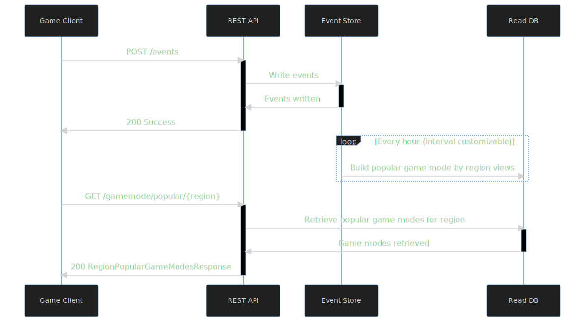

## REST API specification
I created a rough REST API outline in [`api-specification.yaml`](./api-specification.yaml) as an OpenAPI 3 definition.

You can import this specification in the [Swagger Editor](https://editor.swagger.io/) to see the API documentation it would generate, and better visualize the endpoints and schemas.

One part I left out of the specification was authentication as it highly depends on what existing services are available, and how the game authenticates the user.

For now we'll just assume that the entire API endpoint is protected by a means of authentication inherited from either the game's launcher (Steam, Google OAuth, etc.) or in-house auth service.

Every request the game client makes to the API service will be annotated with the necessary `Authorization <auth-scheme> <authorization-parameters>` to identify them.

The game client will report presumably many different user events as telemetry, through the `/events` endpoint.

One of these events could be a `SEARCHED_FOR_MATCH` event with tags `region` and `gamemode`, which will later be used to measure the the most popular game mode in the region.

## Service layer design

I propose an event sourcing style architecture would suit this scenario of powering in-game features based on the user feedback obtained through telemetry reported by game clients rather well with room for extension in future.

The **REST API** will validate the `SEARCHED_FOR_MATCH` event then write it to an **Event Store** (a write optimized database).

Then periodically at a customizable interval the **Read DB** will run a job to rebuild/update the materialized views for the most popular game modes by region.

The **REST API** will then deliver this list of popular game modes to the game client upon request, retrieved from the **Read DB**.

## Storage layer design
It is preferable to have the write/read storage mediums separated, for a few reasons.

- Easy to rebuild new views from the raw events in **Event Store** if the requirements change in future, such as the algorithm used to calculated what is considered "popular".
- You can scale them separately based on demand, e.g. the list of popular game modes can be cached on the game client so the read storage will receive less requests than the write storage.

## Scaling up to millions of CCUs
There are many different ways to do this depending on requirements, but I would advise in all circumstances that there's a clear distinction between the stateless services such as the **REST API** and the stateful services such as **Event Store** and **Read DB** in this example architecture.

This will enable you to horizontally scale the **REST API** through replicas on Kubernetes or some kind of Serverless platform.

For stateful services I would advise using the first-party hosting provider or a cloud platform's managed offering, with replicas in each of the regions you intend to support.

Before deploying this system to `production` and putting it in the hands of the user base. I would also advise that it is first deployed to a **staging**/**canary** environment where an end-to-end load test can be performed through applying load generated either by a beta/flight test with a subset of existing users, or generated artificially via a tool (such as `autocannon`, `JMeter`, etc.).
